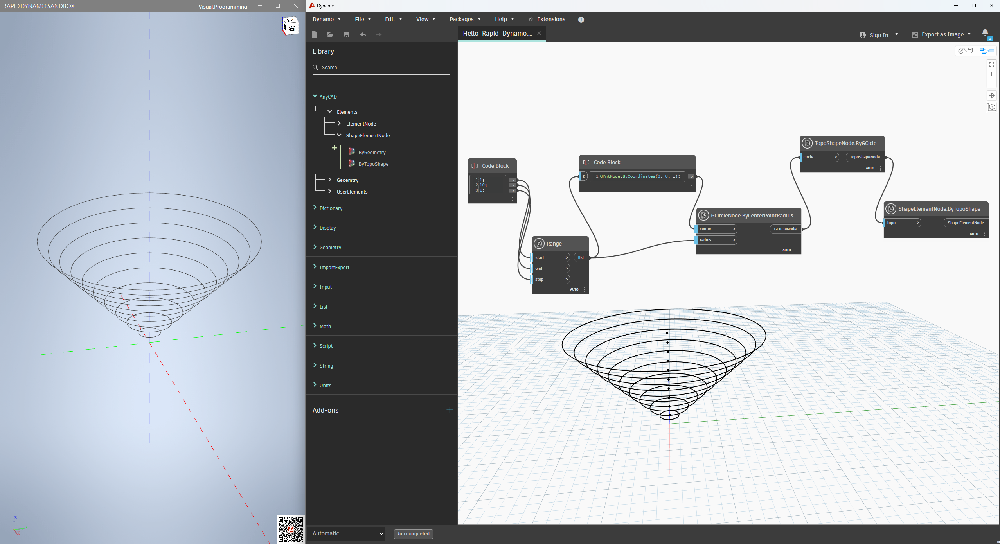

# AnyCAD VisualProgramming Framework
基于[AnyCADSDK](http://www.anycad.net/)与[可视化编程工具Dynamo](https://github.com/DynamoDS/Dynamo/tree/master)实现，帮助用户快速实现用低代码的方式操作AnyCAD对象。本仓库提供了框架的实现源码以及将框架集成到AnyCAD程序、开发扩展AnyCAD节点的示例代码。
## 准备工作

### Windows

1. 安装运行AnyCAD所需依赖，参考repo：[AnyCAD Rapid .NET Sample](https://gitee.com/anycad/anycad.rapid.net.sample)
2. 下载对应版本DynamoCore运行时Release包（地址：[Dynamo Release](https://github.com/DynamoDS/Dynamo/releases)或[Dynamo Builds](https://dynamobuilds.com/)，当前使用v3.0.3版本）并解压到任意目录`<DynamoRuntime>`
3. Clone本仓库代码，打开`src/Demo/AnyCAD.Rapid.Dynamo.Sandbox`目录下的`PostBuildStep.bat`文件将`DynamoRuntime=`后的路径替换为上面的目录
4. 使用Visual Studio打开`AnyCAD.Rapid.Dynamo.sln`，选择Build Solution
5. 运行Sandbox示例程序，即可开始体验**AnyCAD x Dynamo**

### Linux
To be continued..

## 集成AnyCAD程序

参考提供的示例项目AnyCAD.Rapid.Dynamo.Sandbox了解如何将低代码框架集成到已有的AnyCAD程序

## 扩展AnyCAD节点

参考提供的示例项目AnyCAD.UserNodes了解如何扩展和丰富AnyCAD节点

